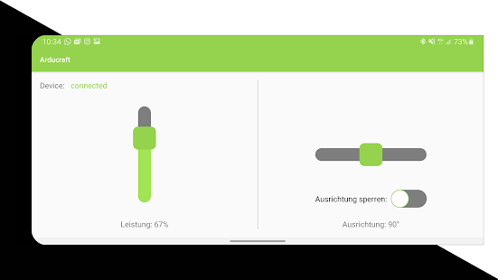

# Arducraft_Public

Arducraft ist ein Hovercraft und basiert auf Arduino. In diesem Projekt befindet sich eine Android Applikation, die über eine Bluetooth-schnittstelle mit einem Arduino kommuniziert. Die Anwendung wurde mit Android Studio und Java entwickelt und beinhaltet eine Steuerung für das Arducraft.
 <h2>Download & Install</h2>
 Die Applikation kann direkt über den <b><a href="https://play.google.com/store/apps/details?id=com.mirkocordes.arducraft">Google Play Store</a></b> installiert werden.
 

 <h2>Bilder</h2>
 Auch stehen ihnen Voschaubilder zur Verfügung. Diese finden sie im Ordner <b><a href="Gallery/">Gallery</a></b>.
